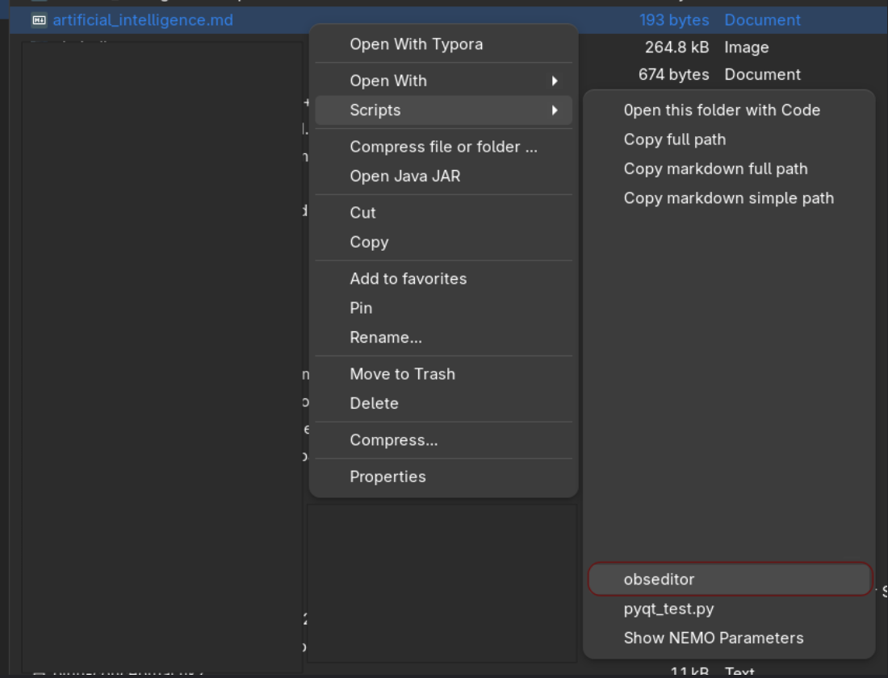
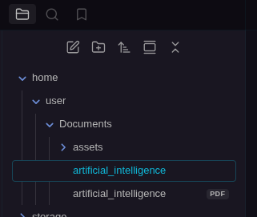

Borrowing some ideas from the script [here]() in the Obsidian forums, I have made some minor modifications for use in Linux. I use CachyOS with GNOME,and Nemo as File Explorer. Thanks [@bvdg](https://forum.obsidian.md/u/bvdg).

In its simplest form, I copy the script **obseditor** to $HOME/.local/share/nemo/scripts. You could do the same in Nautilus. Then, I just select the markdown note that I want to edit in Obsidian from the context menu, and I will get the note and its attached files all in an Obsidian vault. I created a dummy vault for this purpose - I called it “default”, although you can bring off-vault notes to the vault of your preference. You set that in vault_where_files_must_be_opened variable at the top of the bash script.

The trick is creating symbolic links of the original .md file and its linked resources, such as images, PDF files, etc. What you have in Obsidian are all symbolic links. Once you finish your editing (text wrangling, formatting, tables, etc.), you could delete the files from the vault. The original files will persists in the filesystem since they are just inodes.

The main change I made on the original script by *@bvdg* is that instead of creating a `Temp/` folder inside the vault for the outside notes, I recreate the original folder structure where the note was residing. For instance, let’s say I want to import the file “artificial_intelligence.md”. Using Nemo as file explorer, we select the “obseditor” option from the context menu

So, after importing the markdown note in Obsidian it would look to something like this:

This is a recreation of the filesystem in Obsidian; a virtual structure.I found that this folder structure is more informative of the note, or notes, I am dealing with, while providing context of location.

The script is ready for selection of multiple MD files; it will loop `for file in $@` through every markdown note selected in the file explorer creating all the necessary symbolic links.

I know it is not a perfect solution but it works. It can serve other purposes as well, such as note importer, or modified, to be a CLI note editor.

## Notes

1. I usually start markdown notes with Typora with some bare content. Then, I use this script to bring it to Obsidian, to edit it with Obsidian superpowers: plugins, custom JavaScript scripts, advanced tables, formatting, etc. For instance, Typora only supports live embedding for images, while Obsidian natively supports embedding and viewing PDF files.
2. To make the transition of images (links) to Obsidian set your Typora preferences to use “relative paths”
3. If you want to use `obseditor` from the terminal, copy the script to your `$HOME/.local/bin` folder, and set the executable permissions for the script

